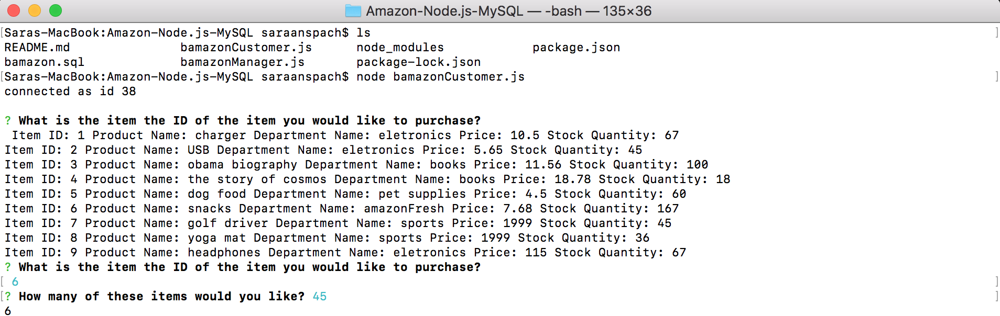
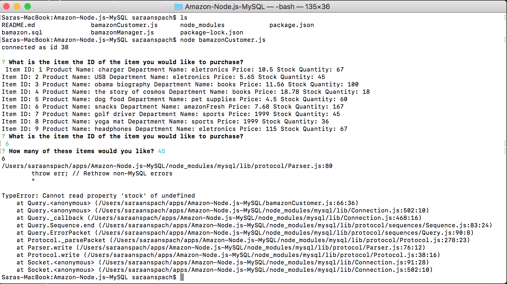
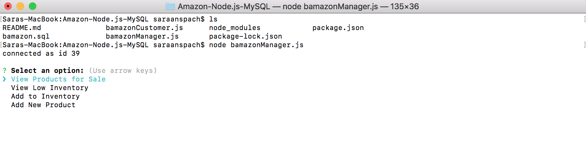

## Amazon-Node.js-MySQL

#Overview

This app creates an Amazon-like storefront with MySQL. 

It will take in orders from customers and update the database for all items in stock from the store's inventory.

The following images illstrate:

#Technologies Used

This app uses:

Node and Express Servers
JQuery
MySQL

#Intructions:

Clone the files and run using bamazonCustomer.js and bamazonManager.js in the command line
*** Remember to npm install all packages (inquirer and mySQL)